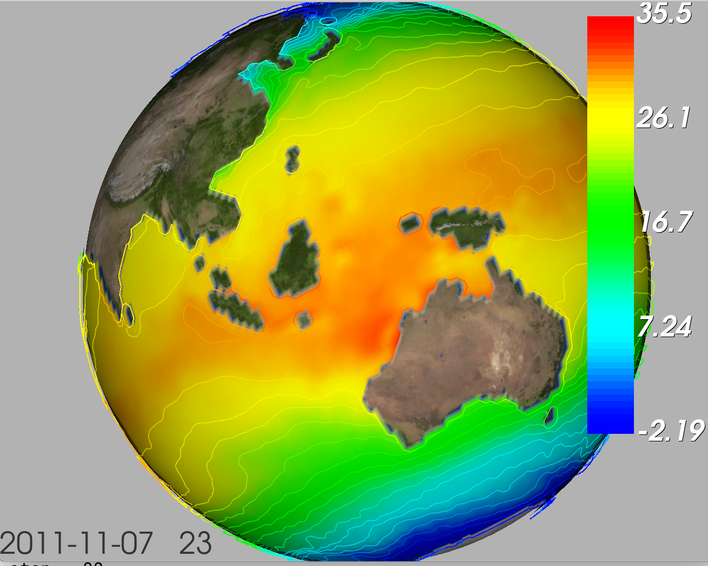

# eorde

A VTK based app that displays contours on the Earth

Eorde (old anglo-saxon for Earth) has a limited number of external dependencies. These are 
 * Python (3.7+)
 * numpy 
 * netCDF4
 * vtk (tested with 8.2)

All these dependencioes can be easily installed with conda.

There is no graphical user interface - you interact with the mouse (zoom, rotation and translation). To read the next time step just type "t" (time) or "b" to step backward. Type "r" to reset the view and "q" to quit.

## How to install eorde

```
pip install eorde
```

If you don't have root access:
```
pip install eorde --user
```

## How to use eorde

Type 
```
eorde -h
```
for a list of options. If you used `pip install eorde --user` to install the package then you may need to type
```
$HOME/.local/bin/eorde -h
```

## Example

```
eorde -f tos_Omon_GFDL-CM4_historical_r1i1p1f1_gr_201001-201412.nc -p sea_surface_temperature -i sea_surface_temperature
```

